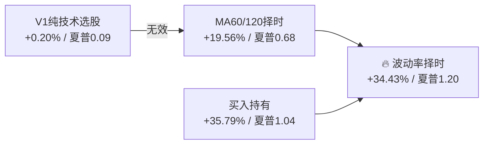

# 📊 每日股票智能分析系统

> ⚠️ **仅供技术参考，不做实盘推荐**
>
> 本项目纯属个人学习研究用途的量化交易实验系统。
> 所有信号、评分、报告均基于历史数据和AI模型生成，**不构成任何投资建议**。
> 实盘交易风险自担，作者不对任何投资损失负责。

---

## 一、一句话

每天收盘推送**四件事**：

```
🌊 波动率择时 → 今日建议仓位
📗 买什么     → 候选股 + 买入信号
📕 卖什么     → 持仓止损/止盈触发
📘 不动       → 持仓正常无需操作
```

---

## 二、核心策略：波动率择时 ⭐

### 发现历程



**关键发现**：A股市场选股alpha几乎为零（+0.20%），超额收益来源于**大盘择时**。
波动率择时在取得与持有几乎相同收益的同时，把回撤从11.27%压到9.18%。

### 波动率择时逻辑

| 20日波动率历史百分位 | 建议仓位 | 含义 |
|:-------------------:|:-------:|------|
| < 30%（低波动） | **100%** | 🟢 市场平稳，满仓操作 |
| 30% ~ 60%（正常） | **75%** | 🟡 正常波动，适度仓位 |
| 60% ~ 80%（偏高） | **50%** | 🟠 波动加剧，降低仓位 |
| ≥ 80%（高波动） | **25%** | 🔴 剧烈波动，轻仓观望 |

**算法**：沪深300的20日滚动波动率 ÷ 过去120天历史百分位。
零参数调优，无未来函数。

### 所有策略对比（2024/05 ~ 2026/05）

| 策略 | 总收益 | 最大回撤 | 夏普 | 特点 |
|------|:-----:|:-------:|:---:|------|
| 沪深300买入持有 | +35.79% | 11.27% | 1.04 | 基准线 |
| **🔥 波动率择时** | **+34.43%** | **9.18%** | **1.20** | **推荐策略** |
| V1纯技术选股 | +0.20% | 27.60% | 0.09 | 选股无效 |
| 择时+选股(V4) | +19.31% | 20.69% | 0.52 | 选股拖累择时 |

> **结论**：在这个回测期内，大盘择时比选股重要100倍。
> 波动率择时开箱即用，不需要调参。

---

## 三、系统架构

```
cron ──→ run_and_send.sh
           │
           ├── 选股器 (全A扫描)
           ├── 全量分析 (LLM决策信号)
           ├── 模拟交易 (持仓+风控)
           ├── 量化引擎 (GARCH/HMM/马科维茨)
           ├── 情绪引擎 (恐慌/贪婪)
           ├── 🌊 波动率择时 (vol_timing)  ← 新增
           │
           推送 ↓
         🟠波动率信号  📗📕📘 三句话  ⚠️极值告警
```

### 角色分工

| 角色 | 身份 | 模型 | 职责 |
|------|------|------|------|
| 🦐 **打工虾** | OpenClaw 主会话 | deepseek-v4-flash | 信息收集、二次审核、整理推送 |
| 🐴 **打工马** | Hermes Agent | deepseek-v4-pro | 编码攻坚、代码Review主审 |

**工作流**：打工马写代码 → 打工马审查 → 打工虾二次审核 → 打工虾提交汇总

### 技术栈

- **Python 3.12** — 核心引擎
- **DeepSeek V4** — AI 模型
- **东方财富 push2 API** — 行情来源
- **MX妙想** — 基本面/选股/新闻
- **Tavily** — 新闻搜索
- **mootdx（通达信）** — 数据补全

---

## 四、每日时间线

```
09:25 ── 早盘
         ├── 选股器
         ├── 全量分析 + 模拟交易
         ├── 🌊 波动率择时
         └── 推送 📗 买入关注 + 🟠 仓位建议

11:30 ── 午盘
         ├── 精简分析
         └── 不推送（盘中异动由 monitor 处理）

09:30~14:50 ── 盘中监控（每10分钟）
         ├── 检测建仓信号
         ├── 持仓风控检查
         └── 异常波动告警

18:00 ── 收盘（核心时段）
         ├── 选股器（选次日候选股）
         ├── 全量分析 + 模拟交易
         ├── 量化引擎（GARCH/HMM/马科维茨）
         ├── 情绪引擎（恐慌/贪婪）
         ├── 🌊 波动率择时
         ├── 信号准确率统计
         └── 推送 🌊📗📕📘 完整四件套
```

---

## 五、推送内容

### 收盘 18:00 完整版

```
🌊 波动率择时：偏高波动（百分位69%）
市场波动加剧，建议降低仓位
🎯 建议仓位：50%

📗 今日买入关注
1. 601689 拓普集团 ¥69.93 [评分90] 放量突破

📕 卖出/止损关注
· 600626 申达股份 ¥3.86 (-3.0%) 🔴 建议止损

📘 持仓状态
💰 总权益 ¥29,496 | 累计 -1.68%
· 510300 沪深300ETF 1500股 ¥7,320 (-0.1%)

⚠️ 市场恐慌指数15/100（仅极值时推送）
🎯 信号准确率统计
```

---

## 六、幸存者偏差修正

沪深300回测中发现了**严重的幸存者偏差**：

| 版本 | 处理 | V1收益 | 真实度 |
|:----:|------|:-----:|:-----:|
| V3旧版 | 用今天成分股回测过去 | **+70.32%** | ❌ 虚高 |
| V4修正 | 按纳入日期过滤股票 | **+0.20%** | ✅ 真实 |

**修正方法**：每只股票都有 `纳入日期` 字段，交易日只允许已纳入的成分股参与评分。

**投机者偏差修正前后差异：-34%（收益被对半砍还要多）**

---

## 七、模拟账户

| 项目 | 数值 |
|------|------|
| 初始资金 | **¥30,000** |
| 持仓上限 | **3只** |
| 佣金 | 万2.5（最低¥5） |
| 印花税 | 万5（仅卖出） |
| 滑点 | ±0.1% |

---

## 八、风险声明

1. **⚠️ 不做实盘推荐**：本系统为个人学习研究用途，所有信号基于历史数据和AI模型生成，不构成投资建议。
2. **幸存者偏差**：历史回测收益已被修正，但无法完全消除其他形式的数据窥探偏差。
3. **波动率择时的局限性**：低波动期可能持续很长时间，但"低波动→满仓"逻辑在尖顶反转时可能来不及减仓。
4. **AI幻觉风险**：LLM评分可能包含幻觉信息，确定性校验层用于兜底，不能完全消除。
5. **单点故障**：依赖crontab + 东方财富API，接口变动可能导致系统异常。

---

## 九、仓库

- 主力: **Gitee** `https://gitee.com/yloveing/daily_stock_analysis`（私有）
- 备份: GitHub `YLoveing/LHJY_Claw.git`
- 上游: GitHub `ZhuLinsen/daily_stock_analysis.git`

---

*🦐 打工虾 + 🐴 打工马 · 仅供技术参考，不做实盘推荐*
